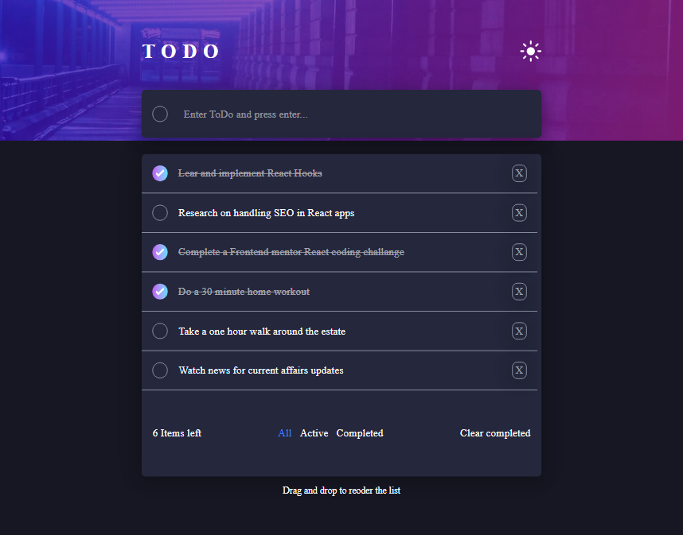

# Dembu Todo App

This is a **full-stack** Todo application that allows users to create, update, and delete tasks. The backend is powered by **Express.js**, and **Redis**, while the frontend is built with **React, Vite, and Tailwind CSS**.

## Table of Contents

- [Overview](#overview)
  - [Features](#features)
  - [Live Demo](#live-demo)
  - [Screenshot](#screenshot)
- [Installation & Setup](#installation--setup)
  - [Installation](#installation)
  - [Environment Variables](#environment-variables)
- [Technologies Used](#technologies-used)
- [What I Learned](#what-i-learned)
- [Continued Development](#continued-development)
- [Acknowledgments](#acknowledgments)

---

## Overview

### Features

- **Create, Read, Update, and Delete (CRUD)** todos
- **Persist data using Redis** as a database
- **Real-time API with Express.js**
- **Frontend built with React, Vite, and Tailwind CSS**
- **Hosted on Vercel** for quick deployment

### Live Demo

- **Live URL:** [View Project](https://dembu-todo.vercel.app/)

### Screenshot



---

## Installation & Setup

### Installation

1. **Clone the repository:**

   ```sh
   git clone https://github.com/moshudougee/dembu-todo.git
   cd dembu-todo
   ```

2. **Install dependencies:**

   ```sh
   npm install
   ```

### Environment Variables

1. **Set up a Redis database:**

   - Install Redis locally or use **Upstash Redis** (free plan available)
   - Set the `REDIS_URL` in `.env`:
     ```env
     REDIS_URL=redis://your-redis-url
     ```

2. **Add the other variables**
   - Set the `VITE_API_URL`, `CLIENT_URL`, and `NODE_ENV` in `.env`:
     ```env
     VITE_API_URL=your-backend-url/api
     CLIENT_URL=your-frontend-url
     NODE_ENV=development or production
     ```

3. **Start the app:**

   ```sh
   npm start
   ```

The frontend should now be running at `http://localhost:5173` and backend at `http://localhost:5000`.

---

## Technologies Used

- **Frontend:** React, Vite, Tailwind CSS
- **Backend:** Express.js, json-server
- **Database:** Redis (Upstash Redis for production)
- **Deployment:** Vercel

---

## What I Learned

- **Integrating Redis as a lightweight database** for fast storage
- **Setting up a full-stack app with Vite and Express**
- **Handling environment variables and CORS settings**
- **Implementing drag-and-drop reordering for todos**
- **Deploying a React + Express app on Vercel, overcoming challenges related to environment variables, CORS configuration, and Redis connectivity in a serverless environment.**

---

## Continued Development

- Implement **user authentication** with JWT
- Enhance **drag-and-drop reordering** functionality for todos by refining user experience and optimizing performance
- Improve **error handling and validation**

---

## Acknowledgments

A special thanks to **Frontend Mentor** for the original challenge inspiration. This project was built to enhance full-stack development skills and API integration.

---

## Author

- **GitHub:** [@moshudougee](https://github.com/moshudougee)
- **LinkedIn:** [Denis Mbuthia](https://www.linkedin.com/in/denis-mbuthia/)
- **Portfolio** [Fullstack Developer](https://denismbuthia-portfolio.vercel.app/)

